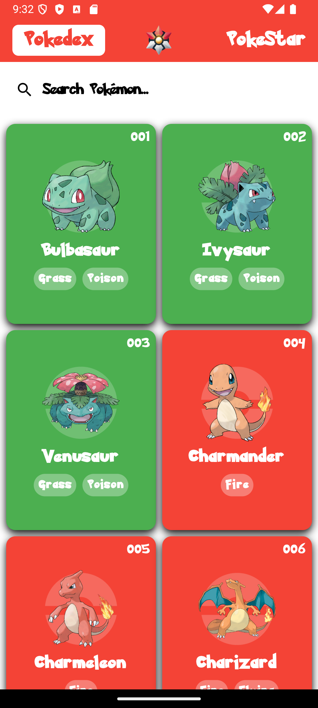
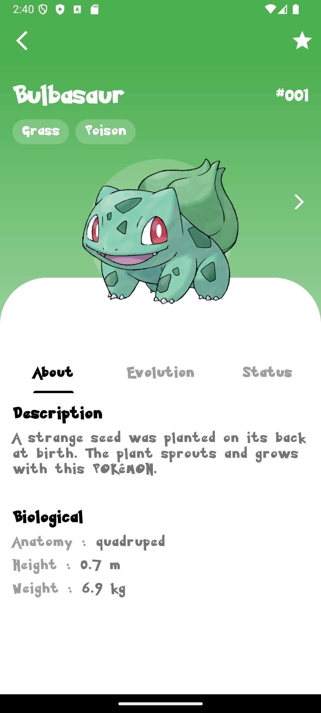
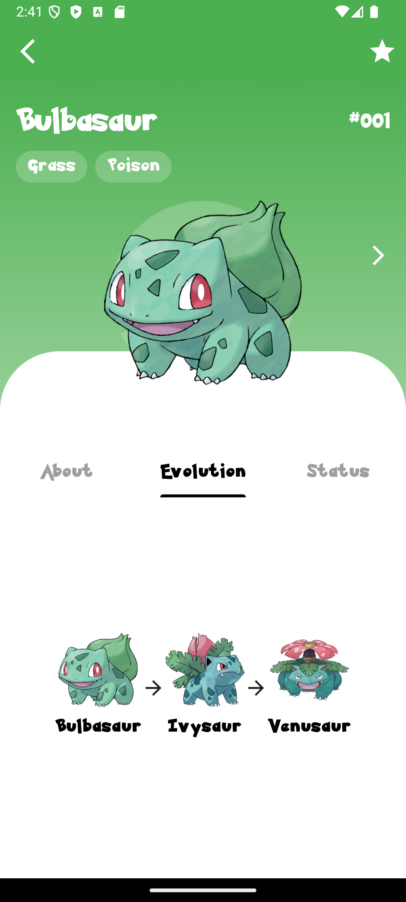
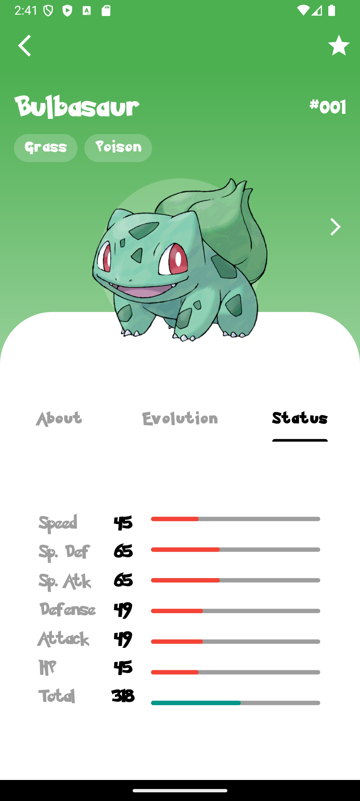
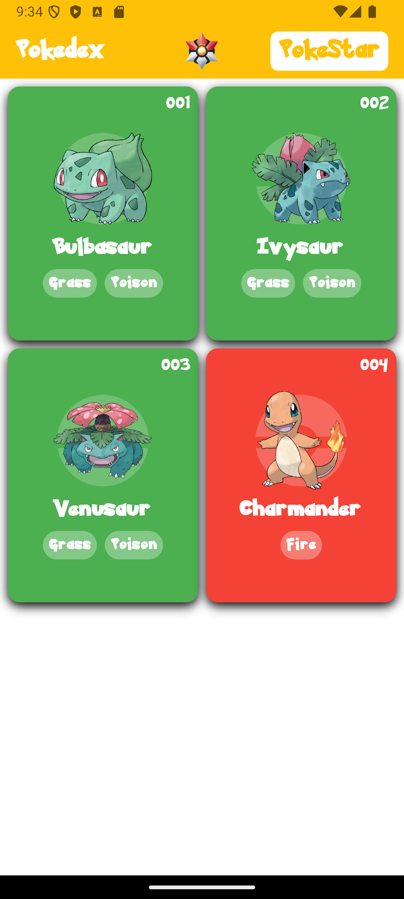

# PokeStar


## Authors
- **Simon BIHAIS**
- **Cécile TESSIER**

---

## Version
- **Flutter**: 83.0.2
- **Dart**: 241.18808

---

## Features

### Home Page
- **Pokémon List**: Displays the complete list of Pokémon.

- **Search**: A search bar to find a specific Pokémon by name or number.

- **Top Bar Navigation**:
  - **PokéStar** Logo: Redirects to the settings page.

  - **PokéStar** Text (on the right): Redirects to the favorites page.

  - **Pokédex** Text (on the left): Indicates the current page.

### Pokémon Details
- **Description**: Displays details about the Pokémon (name, type, etc.).

- **Evolutions**: View previous and next evolutions.

- **Stats**: Displays the Pokémon's stats.

- **Interactive Slider**: Navigate between "Description," 
"Evolutions," and "Stats" sections using a three-choice slider.

- **Side Navigation**: Arrows to move to the next or previous Pokémon.

- **Favorites**: Add or remove a Pokémon from favorites using a star icon at the top right.

### Favorites Page
- **Favorites List**: Displays Pokémon marked as favorites.

- **Top Bar**: Identical to the home page, with **PokéStar** selected.

- **Navigation**: Displays only favorited Pokémon, with options for searching and viewing details.

### Settings
- **Dropdown Menu**:  
  A dropdown menu allows users to select the type of Pokémon images to display (e.g., sprites, official artwork, etc.).

- **Volume Control**:  
  A slider to adjust the background music volume.

- **Music Control Button**:  
  A button to stop or restart the background music playback.

### Music
- **Background Music**:  
  A background music track plays throughout the application.

---

## API Used
- **PokeAPI**:

  - `https://raw.githubusercontent.com/Biuni/PokemonGO-Pokedex/master/pokedex.json`:  
    Used to retrieve Pokémon images.

  - `https://pokeapi.co/api/v2/pokemon-species/`:  
    Provides detailed information about Pokémon species, including descriptions, habitats, and evolutions.

  - `https://pokeapi.co/api/v2/pokemon/`:  
    Used to fetch technical details about Pokémon, such as stats, types, and abilities.

  These APIs provide comprehensive data for displaying Pokémon, their characteristics, evolutions, and images.

---

### Installation

To set up and run the **PokeStar** project on your local machine using Android Studio, follow these steps:

1. **Clone the Repository**:  
   - Open a terminal and run the following command to clone the project repository:
   ```git clone https://github.com/SixMont/PokeStar.git```

2. **Open in Android Studio**:

    - Launch Android Studio
Click on File > Open and navigate to the directory where you cloned the project.
Select the project folder and click OK to open it.

3. **Install Dependencies**
    - Open a terminal and run the following command to get the dependencies: ```flutter pub get```

4. **Run the Application:**

    - Connect an Android emulator or a physical device.
Click on the Run button or use the terminal command:
```flutter run```

---

## Application Screenshots

### Home Page


### Details Page




### Favorites Page


### Parameters Page


### Credits
- **Music**: https://www.youtube.com/watch?v=YhN4oAS3O4c&t=1s